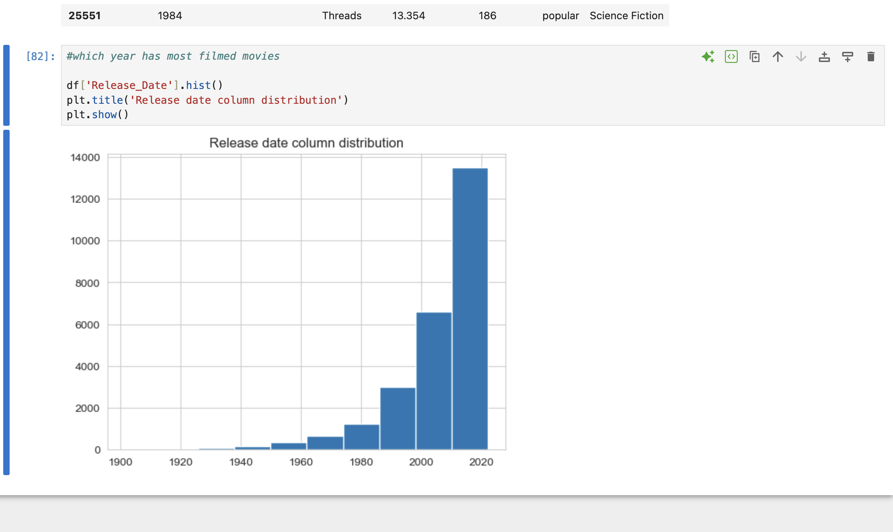
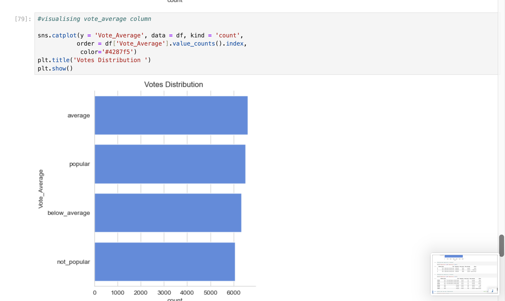
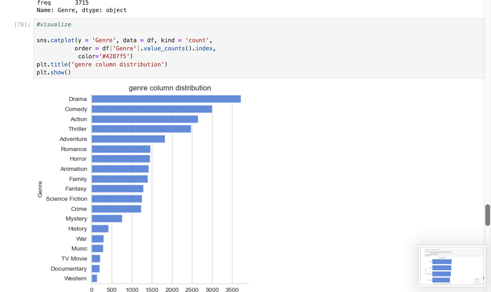
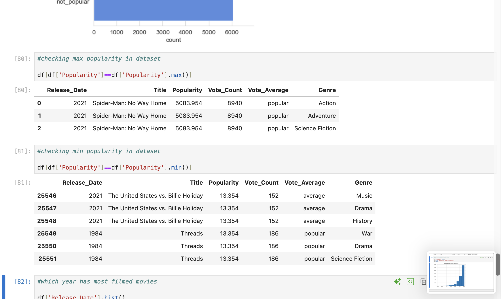

# Movie Data Analysis

An interactive and visual exploration of movie data using Python, JupyterLab, Pandas, Matplotlib, and Seaborn.

---

## Project Overview

This project analyzes a comprehensive movie dataset to answer several key questions:

- **Which year had the most filmed movies?**
- **What is the distribution of movie popularity?**
- **How are vote averages categorized and distributed?**
- **Which genres are the most prevalent?**
- **Which movies had the highest and lowest popularity?**

The analysis includes clear Python code, plots for every key question, and actionable insights into trends in the movie industry.

---

## Key Questions & Insights

### 1. Which year has the most filmed movies?

A distribution histogram reveals a huge rise in films released in recent years, peaking after 2000.

---

### 2. How is the "Vote_Average" column distributed?

A count plot groups movies by voting categories like "not_popular", "below_average", "average", and "popular".

---

### 3. What is the distribution of movie genres?

Genres such as Drama, Comedy, and Action are the most common, as shown in the bar plot.

---

### 4. Which movies are the most and least popular?

The tables below summarize findings (see notebook for details):

- **Most popular:**  
  - *Spider-Man: No Way Home* (2021), with a popularity

  **Least popular:**  
  - *The United States vs. Billie Holiday* (2021) and *Threads* (1984), with a popularity of 13.354

---

## Tools Used

- Python, Pandas, Numpy
- Matplotlib, Seaborn
- JupyterLab
- Git & GitHub

---

## Author

[Adishree Srikumar](https://www.linkedin.com/in/adishree-s-151085268/)

---

## License

This project is licensed under the MIT License.

---

*Thank you for checking out my project! If you find it useful, star the repo and connect with me!*

